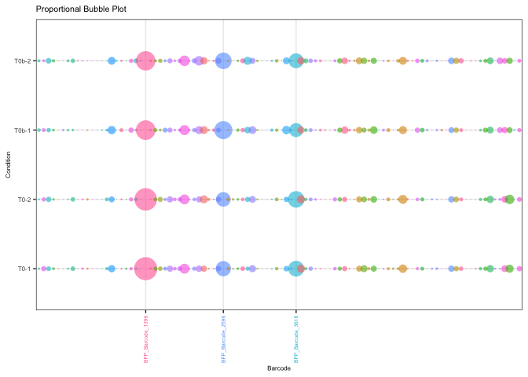
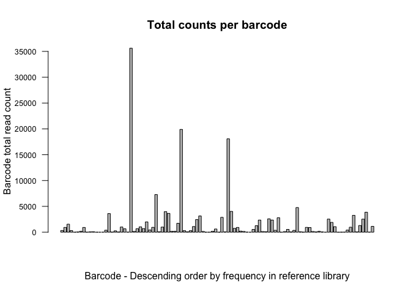
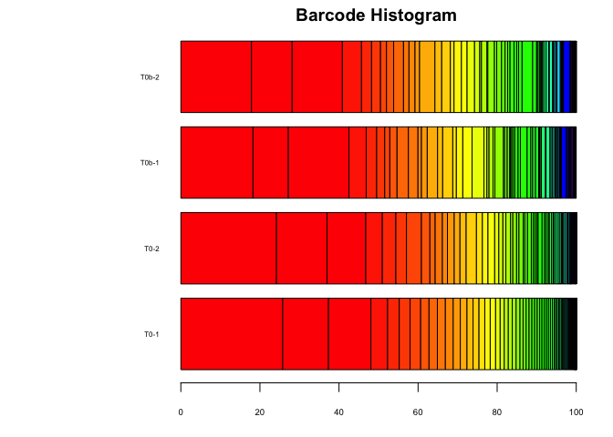
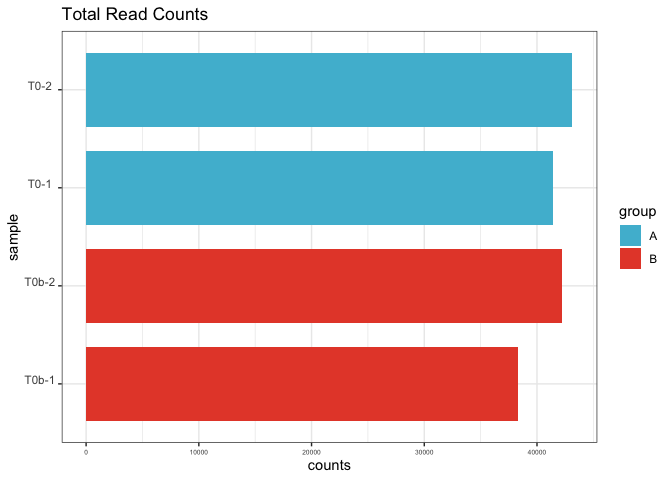

<!-- README.md is generated from README.Rmd. Please edit that file -->

# barista

<!-- badges: start -->
<!-- badges: end -->

barista is an R-based toolkit for the analysis of synthetic barcodes in
the genome and transcriptome

## Installation

You can install the development version of barista from
[GitHub](https://github.com/) with:

``` r
# install.packages("devtools")
devtools::install_github("DaneVass/barista",  dependencies = TRUE)
```

## Examples

`barista` can preprocess, normalise and visualise all types of synthetic
barcode count data.

``` r
library(barista)
library(ggplot2)

data("test.counts")
## plot from counts files
plotBarcodeBubble(test.counts)
#> Warning: Vectorized input to `element_text()` is not officially supported.
#> Results may be unexpected or may change in future versions of ggplot2.
```



``` r
plotBarcodeCounts(test.counts)
```



``` r
plotBarcodeHistogram(test.counts, sample = "T0-1", top = 100)
```



``` r
plotReadCounts(test.counts, group = c("A", "A", "B", "B"))
```


